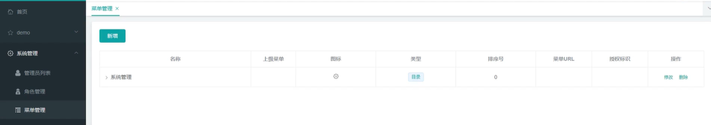
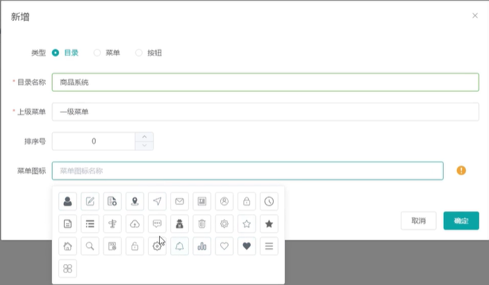
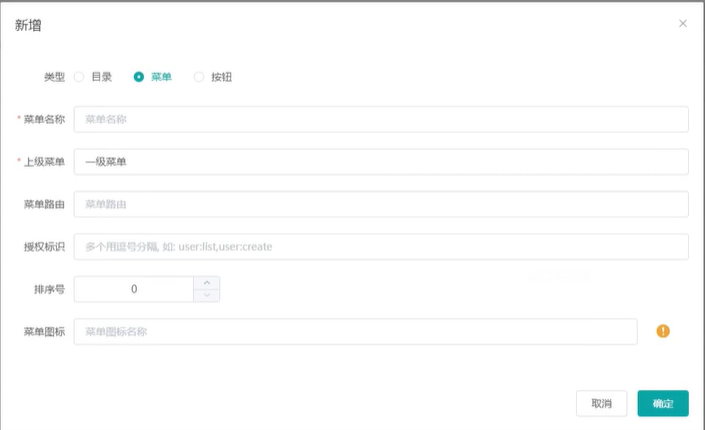

# Vue + Element UI 项目

这是一个基于 Vue 3 + Element Plus 的前端项目模板。

## 技术栈

- **Vue 3.3.4** - 渐进式 JavaScript 框架
- **Element Plus 2.4.4** - 基于 Vue 3 的组件库
- **Vue Router 4.2.5** - Vue.js 官方路由管理器
- **Vite 4.5.0** - 下一代前端构建工具

## 项目结构

```
bilibili_mall_font/
├── src/
│   ├── components/     # 组件
│   │   ├── SidebarMenu.vue    # 侧边栏菜单组件
│   │   └── ContentArea.vue    # 内容展示区域组件
│   ├── utils/          # 工具函数
│   │   └── api.js      # API请求工具
│   ├── views/          # 页面组件
│   │   ├── Home.vue    # 首页
│   │   └── About.vue   # 关于页面
│   ├── router/         # 路由配置
│   │   └── index.js
│   ├── App.vue         # 根组件
│   └── main.js         # 入口文件
├── index.html          # HTML 模板
├── vite.config.js      # Vite 配置
└── package.json        # 项目配置
```

## 快速开始

### 安装依赖

```bash
npm install
```

### 开发模式

```bash
npm run dev
```

项目将在 `http://localhost:3000` 启动

### 构建生产版本

```bash
npm run build
```

### 预览生产构建

```bash
npm run preview
```

## 功能特性

- ✅ Vue 3 Composition API
- ✅ Element Plus UI 组件库
- ✅ Vue Router 路由管理
- ✅ Vite 快速构建
- ✅ 左侧菜单栏 + 右侧内容区布局
- ✅ 动态菜单加载（从接口获取）
- ✅ 多级菜单支持
- ✅ 标签页内容管理
- ✅ 菜单折叠/展开功能
- ✅ 支持外部链接（iframe）和内部路由

## 开发说明

### 菜单接口配置

项目默认从 `http://localhost:8070/admin/menu/tree` 获取菜单数据。如需修改接口地址，请编辑 `src/utils/api.js` 文件中的 `API_BASE_URL`。

### 菜单数据结构

菜单接口返回的数据格式：

```json
{
  "code": "0",
  "status": "success",
  "data": [
    {
      "menuId": 1,
      "name": "系统管理",
      "icon": "system",
      "url": null,
      "type": 0,
      "children": [...]
    }
  ]
}
```

### 布局说明

- **左侧菜单栏**：深色主题，支持多级菜单展开/折叠
- **右侧内容区**：使用标签页管理多个页面，支持iframe和内部路由
- **菜单折叠**：点击左上角按钮可折叠/展开菜单

### 使用 Element Plus 组件

项目已全局引入 Element Plus，可以直接在组件中使用：

```vue
<template>
  <el-button type="primary">按钮</el-button>
</template>
```

## 许可证

MIT


# 菜单管理

1. 点击菜单管理在右侧展示菜单列表, 数据获取接口 GET http://localhost:8070/admin/menu/tree, 页面布局参考

   

2. 新增菜单窗口参考截图, 点击菜单图标输入框弹出图标选择窗口
   

   如果是菜单的话, 新增窗口略有不同, 请参考截图

   

3. 点击确定后调用接口POST http://localhost:8070/admin/menu/create 创建菜单

   传递JSON数据, 包含的字段有如下这些

   ```
   	/**
   	 * 菜单ID
   	 */
   	private Long menuId;
   
   	/**
   	 * 父菜单ID，一级菜单为0
   	 */
   	private Long parentId;
   
   	/**
   	 * 菜单名称
   	 */
   	@NotEmpty(message = "菜单名称不能为空")
   	private String name;
   
   	/**
   	 * 菜单URL
   	 */
   	private String url;
   
   	/**
   	 * 授权(多个用逗号分隔，如：user:list,user:create)
   	 */
   	private String perms;
   
   	/**
   	 * 类型   0：目录   1：菜单   2：按钮
   	 */
   	private Integer type;
   
   	/**
   	 * 菜单图标
   	 */
   	private String icon;
   
   	/**
   	 * 排序
   	 */
   	private Integer orderNum;
   ```

   当然, 在创建的时候不需要传递menuId, 这在更新的时候才需要传

4. 点击删除按钮的时候调用 DELETE http://localhost:8070/admin/menu/delete/{menuId} 删除菜单, 其中{menuId}要替换成实际的菜单id

   

